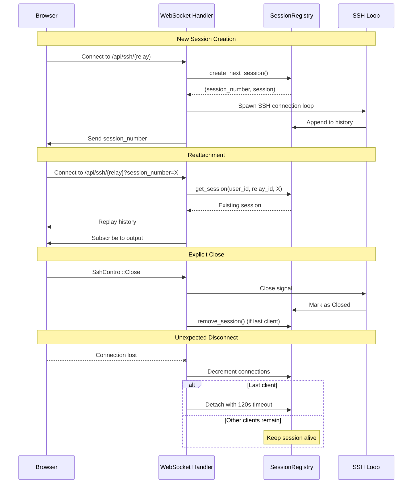
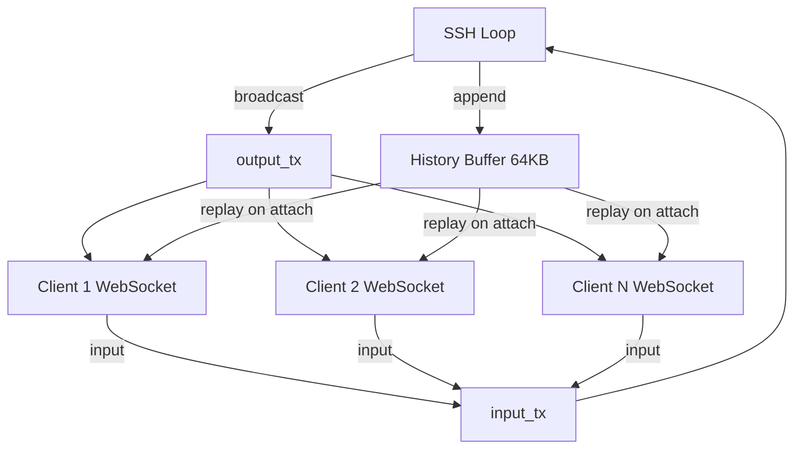
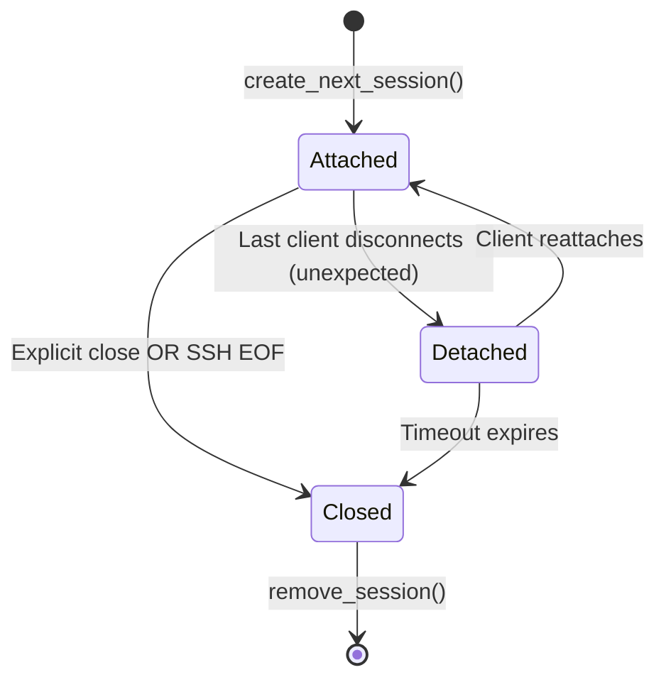

# Web Shell Implementation Status

> **Last Updated**: 2025-11-30
> **Branch**: `webshell-refactor`

## Executive Summary

This document provides a comprehensive overview of the web shell implementation for RustyBridge. It consolidates information from multiple older planning documents ([WEB_SHELL_PLAN.md](../docs/WEB_SHELL_PLAN.md), [AUTO_LOAD.md](../docs/AUTO_LOAD.md), [WEB_ATTACH.md](../docs/WEB_ATTACH.md)) and reflects the current state of uncommitted changes.

### Vision

Provide persistent, user-friendly SSH terminals in the web UI with:
- **Session persistence** across page navigation and browser refreshes
- **Multi-session support** with a 4-session client-side cap
- **Detach/reattach workflow** for seamless reconnection
- **Multi-viewer support** allowing multiple browser tabs/windows to connect to the same SSH session
- **Floating window management** with drag, resize, minimize, and fullscreen capabilities

---

## Current Implementation State

### ✅ Phase 1: Baseline Functionality (COMPLETE)

#### Server-Side Session Registry
**Location**: [crates/server-core/src/sessions.rs](../crates/server-core/src/sessions.rs)

- ✅ `SessionRegistry` with thread-safe session management
- ✅ `SshSession` struct with:
  - Session identification: `(user_id, relay_id, session_number)`
  - State management: `Attached`, `Detached`, `Closed`
  - Multi-viewer support via `active_connections` counter
  - Scrollback history buffer (64KB)
  - Broadcast channels for multi-attach (`output_tx`)
  - Input channel for client→SSH data (`input_tx`)
  - Close signal broadcast (`close_tx`)
- ✅ Session lifecycle methods:
  - `create_next_session()` - Auto-increments session numbers
  - `get_session()` - Retrieve by (user_id, relay_id, session_number)
  - `remove_session()` - Cleanup
  - `list_sessions_for_user()` - Query all user sessions
  - `cleanup_expired_sessions()` - Background cleanup task
- ✅ History management:
  - `append_to_history()` - Circular buffer with 64KB cap
  - `get_history()` - Replay on reattach

#### WebSocket API
**Location**: [crates/rb-web/src/app/api/ws/ssh.rs](../crates/rb-web/src/app/api/ws/ssh.rs)

- ✅ `GET /api/ws/ssh_connection/{relay_name}?session_number` - WebSocket endpoint with reattach support
- ✅ `GET /api/ssh/{relay_name}/status` - Authorization check endpoint
- ❌ `GET /api/ssh/sessions` - List active sessions for current user (REPLACED by real-time events WebSocket)
- ✅ Typed WebSocket messages:
  - `SshClientMsg` - Client→Server (data + control commands)
  - `SshServerMsg` - Server→Client (data + EOF + exit_status + session_id)
  - `SshControl` - Control commands (Close, Resize)
- ✅ `handle_new_session()` - Creates SSH connection and session
- ✅ `handle_reattach()` - Reattaches to existing session with history replay
- ✅ Explicit close detection:
  - Distinguishes between user-initiated close vs network disconnect
  - Explicit close → immediate cleanup (if last client)
  - Unexpected disconnect → detach with 120s timeout
- ✅ Multi-viewer support:
  - Connection counting with atomic operations
  - Broadcast output to all attached clients
  - Shared input from any client

#### Session Events WebSocket
**Location**: [crates/rb-web/src/app/api/ws/session_events.rs](../crates/rb-web/src/app/api/ws/session_events.rs)

- ✅ `GET /api/ws/ssh_web_events` - User-authenticated WebSocket for real-time session updates
- ✅ `SessionEvent` enum with variants:
  - `Created(user_id, UserSessionSummary)` - New session created
  - `Updated(user_id, UserSessionSummary)` - Session state changed
  - `Removed { user_id, relay_id, session_number }` - Session removed
  - `List(Vec<UserSessionSummary>)` - Initial list of active sessions
- ✅ `UserSessionSummary` struct:
  - Contains: `relay_id`, `relay_name`, `session_number`, `state`, `active_connections`, `created_at`, `last_active_at`
- ✅ Real-time updates for all session lifecycle events
- ✅ Initial sync of existing sessions on connection

#### Frontend Session Management
**Location**: [crates/rb-web/src/app/session/](../crates/rb-web/src/app/session/)

**Types** ([types.rs](../crates/rb-web/src/app/session/types.rs)):
- ✅ `Session` model with:
  - `id` (UUID for window management)
  - `session_number` (backend session identifier)
  - `relay_name`, `title`, `status`
  - `minimized`, `fullscreen`, `geometry`
  - `thumbnail_data_url` (for dock preview)
  - `last_focused_at`, `z_index` (for window stacking)
- ✅ `SessionStatus` enum: Connecting, Connected, Closed, Error
- ✅ `WindowGeometry` struct: x, y, width, height

**Provider** ([provider.rs](../crates/rb-web/src/app/session/provider.rs)):
- ✅ `SessionContext` with 4-session cap enforcement
- ✅ Session actions:
  - `open()` - Create new session window
  - `open_restored()` - Open window for existing backend session
  - `close()` - Remove window
  - `close_with_command()` - Send explicit close to server before removing
  - `minimize()`, `restore()`, `focus()`
  - `toggle_fullscreen()`
  - `set_geometry()`, `set_status()`, `set_thumbnail()`
  - `set_session_number_from_term_id()` - Link window to backend session
- ✅ Drag-and-drop window management:
  - `start_drag()`, `update_drag()`, `end_drag()`
  - Z-index recalculation based on focus time
- ✅ Session cap event: `rb-session-cap-reached` custom event
- ✅ **Real-time session synchronization** via WebSocket:
  - Automatic subscription to session events
  - Auto-restore all active sessions on page load
  - Auto-open new sessions as minimized windows
  - Automatic cleanup when sessions are closed on server
  - Stale localStorage cleanup

**Components** ([components/](../crates/rb-web/src/app/session/components/)):
- ✅ `SessionGlobalChrome` ([global_chrome.rs](../crates/rb-web/src/app/session/components/global_chrome.rs)):
  - Dual drawer layout (left: sessions, right: relays)
  - Global mouse handlers for drag/drop
  - Tab-based navigation
- ✅ `SessionDock` ([session_dock.rs](../crates/rb-web/src/app/session/components/session_dock.rs)):
  - Minimized session chips with status indicators
  - Click to restore
- ✅ `SessionWindow` ([session_window.rs](../crates/rb-web/src/app/session/components/session_window.rs)):
  - Floating, draggable windows
  - Header with title, controls (minimize, fullscreen, close)
  - Fixed positioning with z-index management
  - Fullscreen mode

#### Terminal Component
**Location**: [crates/rb-web/src/app/components/terminal.rs](../crates/rb-web/src/app/components/terminal.rs)

- ✅ Dioxus typed WebSocket integration
- ✅ `on_close` callback for session cleanup
- ✅ Parallel receiving loop (fixes output blocking issue)
- ✅ Input capture with retry loop
- ✅ Explicit focus handling via `window.focusTerminal()`
- ✅ EOF handling with `eof: bool` flag

#### JavaScript Bridge
**Location**: [crates/rb-web/public/xterm-init.js](../crates/rb-web/public/xterm-init.js)

- ✅ `window.writeToTerminal()` - Write data from Rust to xterm
- ✅ `window.setupTerminalInput()` - Setup input callback to Rust
- ✅ `window.focusTerminal()` - Explicit focus trigger
- ✅ `window.fitTerminal()` - Trigger fit addon
- ✅ ResizeObserver with visibility checks
- ✅ Removed legacy `attachWebSocketToTerminal()` (now handled in Rust)

---

## TESTING NOTES FOR CHECKING BUILD SUCCESS FAILURE

Check Client side code with `cargo check -p rb-web --features web --no-default-features --target wasm32-unknown-unknown`
Check Server side code with `cargo check -p rb-web --features server`

---

## 🚧 Phase 2: In Progress (Polish & Complete MVP)

### Priority 1: LocalStorage Integration

> [!IMPORTANT]
> **Goal**: Persist window geometry and dock state across page refreshes, with cleanup of actually clsed sessions properly.

#### Remaining Work
- [x] **LocalStorage helpers** in session provider:
  - Save/load window geometry per session (x, y, width, height)
  - Save/load dock collapsed state
  - Save/load minimized state per session
- [x] **Security considerations**:
  - Only store non-sensitive UI state (geometry, dock state, session_number)
  - Clear stale entries when sessions expire
  - Key format: `rb-session-{user_id}-{relay_id}-{session_number}`
- [x] **Auto-restore on page load**:
  - **CHANGED**: Real-time WebSocket events handle session restoration instead of polling /api/ssh/sessions
  - For each active session, call `open_restored(relay_name, session_number)`
  - Restore geometry from localStorage
  - Restore minimized/dock state
  - Toast notifications for restored sessions.
  - Cleanup stale localStorage entries

**Files to Modify**:
- [crates/rb-web/src/app/session/provider.rs](../crates/rb-web/src/app/session/provider.rs) - Add localStorage helpers and real-time WebSocket integration
- [crates/rb-web/src/app/app_root.rs](../crates/rb-web/src/app/app_root.rs) - Removed polling logic (now handled by SessionProvider)

---

### Priority 2: Real-Time Session Sync

> [!IMPORTANT]
> **Goal**: Replace polling with push-based session updates

#### Current State
- ✅ HTTP endpoint `/api/ssh/sessions` exists
- ✅ **Real-time session events WebSocket implemented**: `/api/ws/ssh_web_events`
- ✅ **Server-side broadcast channel**: Added to `SessionRegistry` with events for `create_next_session()`, `attach()`, `detach()`, `close()`
- ✅ **Frontend integration**: SessionProvider subscribes to real-time events
- ✅ **Auto-open new sessions**: New sessions automatically open as minimized windows with toast notifications
- ✅ **Session state updates**: Real-time updates for session status and connection count
- ✅ **Session removal handling**: Windows automatically close when sessions are removed on server
- ✅ **Auto-restore on connect**: All active sessions are restored when WebSocket connects

#### Completed Work
- [x] **WebSocket endpoint** for session events:
  - `GET /api/ws/ssh_web_events` - User-authenticated WebSocket for session events
  - Stream events: `SessionCreated`, `SessionUpdated`, `SessionRemoved`, `SessionList` using `SessionEvent` enum
  - Include: `relay_id`, `session_number`, `state`, `active_connections`, timestamps
- [x] **Server-side broadcast**:
  - Added broadcast channel to `SessionRegistry`
  - Emit events on `create_next_session()`, `attach()`, `detach()`, `close()`, `remove_session()`
  - Filter events per user in WebSocket handler
  - Session events include comprehensive session summary data
- [x] **Frontend integration**:
  - Subscribe to session events on mount instead of polling
  - Auto-open minimized windows for new sessions (with toast notification)
  - Update session status/connection count in real-time
  - Handle session removal (close windows and clean up localStorage)
  - Restore all active sessions on WebSocket connection
  - Clean up stale localStorage entries

**Files to Create/Modify**:
- Created: `crates/rb-web/src/app/api/ws/session_events.rs` - Session events WebSocket endpoint
- Created: `crates/rb-web/src/app/api/ws/mod.rs` - WebSocket module structure
- Modified: [crates/server-core/src/sessions.rs](../crates/server-core/src/sessions.rs) - Add event broadcast and session summary
- Modified: [crates/rb-web/src/app/session/provider.rs](../crates/rb-web/src/app/session/provider.rs) - Subscribe to events and handle all session lifecycle
- Modified: [crates/rb-web/src/app/api/ws/ssh.rs](../crates/rb-web/src/app/api/ws/ssh.rs) - Renamed from ssh_websocket.rs and updated imports
- Modified: [crates/rb-types/src/ssh.rs](../crates/rb-types/src/ssh.rs) - Added SessionEvent enum and related types

---

### Priority 2b: Multi-Session Connection Indicators (PARTIAL - Polish Pending)

> [!IMPORTANT]
> **Goal**: Provide clear visual feedback when multiple viewers are connected to the same SSH session

#### Completed Work (Core Functionality)
- [x] **Connection count badge**:
  - Shows "{N} viewers" badge in session window header when `active_connections > 1`
  - Updates in real-time via WebSocket SessionEvent::Updated events
  - Yellow badge with white text for visibility
- [x] **Confirm dialog on close when multi-session**:
  - Prompts user to confirm when closing a session with `active_connections > 1`
  - Dialog explains that closing will disconnect all viewers
  - User can choose to: close for everyone (OK) or minimize instead (Cancel)
- [x] **Yellow warning bar at top of terminal**:
  - Displays when `active_connections > 1`
  - Shows warning icon and message: "{N} sessions connected to this shell"
  - Positioned at top of terminal content area
- [x] **Real-time connection count tracking**:
  - Added `active_connections` field to Session type
  - Updated from SessionEvent::Updated events
  - Passed through on session restoration
- [x] **Bug fixes**:
  - Fixed session deduplication (no more duplicate windows)
  - Fixed race condition on session creation
  - Fixed connection count broadcasts from server

#### Completed Work (Polish & UX Refinements)
- [x] **Global session indicator in header**:
  - Added "Active Web Sessions" indicator in top-right corner
  - Shows count of total connected web sessions (tabs/browsers) for the user
  - Tooltip breaks down active web sessions vs shared SSH sessions
  - **Purpose**: Global awareness of presence across multiple devices/tabs

- [x] **Window-level active viewer tracking**:
  - Tracking minimize state per viewer (not just per session)
  - Server tracks which connections have window minimized vs open
  - Added `active_viewers` field (separate from `active_connections`)
  - **Purpose**: Distinguish between "2 connections" vs "2 people actually viewing this terminal"

- [x] **Refined yellow warning bar behavior**:
  - Removed the viewer count badge from the xterm header
  - Change logic: Show yellow bar only when `active_viewers > 1`
  - **Purpose**: Only warn for closing when multiple people are ACTIVELY viewing the same terminal

- [x] **Refined close confirmation**:
  - Change logic: Only confirm when `active_viewers > 1`
  - If only this window is open, close immediately (no confirmation)
  - If others are actively viewing, confirm before closing
  - **Purpose**: Don't annoy user with confirmation when no one else is watching

- [x] **Session dock & drawer viewer indicators**:
  - Added viewer count badge on each session chip in the dock
  - Added viewer count badge on session list items in the side drawer
  - Shows number of browsers with window OPEN (not just connected)
  - **Purpose**: Quick visibility of which sessions have active viewers

- [x] **Replace browser confirm with modal**:
  - Created custom confirmation modal component inside SessionWindow
  - Better styling and branding consistency
  - Shows "Minimize (Just Me)" vs "Close (For Everyone)" options
  - **Purpose**: Professional UX that matches the rest of the app

**Implementation Notes**:
- **Server changes**: 
  - Added `active_viewers` to `SshSession`
  - Added `web_connections` tracking to `SessionRegistry`
  - Added `SessionEvent::Presence` for active web session tracking
- **Frontend state**: 
  - Added `active_viewers` to Session type
  - Added `active_web_sessions` to SessionContext
- **Terminal**: Added `minimized` prop and logic to send minimize state to server

**Files Modified**:
- [crates/server-core/src/sessions.rs](../crates/server-core/src/sessions.rs)
- [crates/rb-types/src/ssh.rs](../crates/rb-types/src/ssh.rs)
- [crates/rb-web/src/app/api/ws/ssh.rs](../crates/rb-web/src/app/api/ws/ssh.rs)
- [crates/rb-web/src/app/api/ws/session_events.rs](../crates/rb-web/src/app/api/ws/session_events.rs)
- [crates/rb-web/src/app/session/types.rs](../crates/rb-web/src/app/session/types.rs)
- [crates/rb-web/src/app/session/provider.rs](../crates/rb-web/src/app/session/provider.rs)
- [crates/rb-web/src/app/session/components/session_window.rs](../crates/rb-web/src/app/session/components/session_window.rs)
- [crates/rb-web/src/app/session/components/session_dock.rs](../crates/rb-web/src/app/session/components/session_dock.rs)
- [crates/rb-web/src/app/session/components/global_chrome.rs](../crates/rb-web/src/app/session/components/global_chrome.rs)
- [crates/rb-web/src/app/components/navbar.rs](../crates/rb-web/src/app/components/navbar.rs)
- [crates/rb-web/src/app/components/terminal.rs](../crates/rb-web/src/app/components/terminal.rs)

---

### ✅ Priority 3: Window Management Polish (COMPLETE)

> **Goal**: Enhance window management with resizing, keyboard navigation, and tiling capabilities

#### Completed Work
- [x] **Bounds checking**: Prevent windows from being dragged off-screen
- [x] **Default window geometry**:
  - Cascade windows (offset by 30px x/y per window)
  - Base position at (100, 100) for first window
  - Implemented `calculate_default_geometry()` in SessionContext
- [x] **Session numbers**:
  - Session numbers visible in xterm chrome when multiple sessions of same relay are connected
  - Session numbers visible in sidebar (e.g., "pve #1", "pve #2") when multiple sessions exist
  - Implemented in `SessionWindow` and `SessionGlobalChrome` components
- [x] **Focus Fix**:
  - New terminal windows automatically gain cursor focus after 300ms delay
  - Restored windows from minimized state automatically gain focus
  - Implemented via `window.focusTerminal()` JavaScript bridge
- [x] **Window resizing**:
  - Resize handles at all 8 positions (4 edges + 4 corners)
  - Minimum window size enforced (200x150px)
  - Resized dimensions saved to localStorage
  - Terminal fit triggered automatically on resize
  - Implemented `ResizeState` and `ResizeDirection` in SessionContext
- [x] **Keyboard navigation**:
  - Tab order for window focus (`tabindex="0"` on SessionWindow)
  - Focus handler updates z-index to bring window to front
  - Keyboard-accessible window management
- [x] **Window tiling**:
  - Snap to left/right half (drag to left/right edge)
  - Snap to corners for 1/4 screen (drag to corners)
  - Snap to top/bottom half (drag to top/bottom edge)
  - Visual snap preview with blue outline
  - Configurable snap behavior (snap below navbar vs screen edge)
  - Snap preview respects navbar height setting
  - Implemented in `update_drag()` and `end_drag()` methods

**Implementation Details**:
- **Resize State**: Added `resize_state: Signal<Option<ResizeState>>` to SessionContext
- **Snap Preview**: Added `snap_preview: Signal<Option<WindowGeometry>>` to SessionContext
- **Snap Settings**: Added `snap_to_navbar: Signal<bool>` with localStorage persistence
- **Resize Handles**: 8 resize handles rendered in SessionWindow component
- **Global Mouse Handlers**: Updated in SessionGlobalChrome for drag/resize/snap
- **Geometry Validation**: `validate_geometry_on_screen()` ensures windows stay within bounds
- **Focus Management**: `focus()` method updates z-index and calls `recalculate_z_indexes()`

**Files Modified**:
- [crates/rb-web/src/app/session/provider.rs](../crates/rb-web/src/app/session/provider.rs) - Resize/snap state and logic
- [crates/rb-web/src/app/session/components/session_window.rs](../crates/rb-web/src/app/session/components/session_window.rs) - Resize handles, focus, session numbers
- [crates/rb-web/src/app/session/components/global_chrome.rs](../crates/rb-web/src/app/session/components/global_chrome.rs) - Global handlers, snap preview, session numbers

---

### ✅ Bug Fixes and Polish (COMPLETE)

#### Completed Work
- [x] **Window Restoration Bug**:
  - Fixed race condition where `user_id` was `None` during session restoration
  - Modified `open_restored()` to accept `user_id` as parameter
  - Implemented deferred restoration with auth polling (100ms intervals, 5s timeout)
  - Windows now consistently restore to saved positions from localStorage
- [x] **Z-Index Issues**:
  - Increased drawer z-index from 54/55 to 200/201
  - Increased active users dropdown z-index from 1 to 202
  - Drawers and dropdowns now properly layer above terminal windows
- [x] **Unused Variable Warnings**:
  - Added `#[cfg(feature = "web")]` to `new_session_id` variables
  - Suppressed false-positive warnings for web-only code
- [x] **Broadcast Warnings**:
  - Added `receiver_count()` check before logging broadcast errors
  - Eliminated spurious warnings when no WebSocket subscribers exist
  - Applied to `increment_connections()`, `decrement_connections()`, `increment_viewers()`, `decrement_viewers()`
- [x] **Snap Behavior Settings**:
  - Added "Web Settings" section to Profile page
  - Implemented DaisyUI toggle for snap behavior preference
  - Setting stored in localStorage as `rb-snap-to-navbar` (default: true)
  - Dynamic description shows current behavior
  - Asterisk indicator for localStorage-only settings
  - Footer note explains localStorage vs server-synced settings

**Files Modified**:
- [crates/rb-web/src/app/session/provider.rs](../crates/rb-web/src/app/session/provider.rs) - Window restoration fix, snap settings
- [crates/rb-web/src/app/components/navbar.rs](../crates/rb-web/src/app/components/navbar.rs) - Dropdown z-index
- [crates/rb-web/src/app/session/components/global_chrome.rs](../crates/rb-web/src/app/session/components/global_chrome.rs) - Drawer z-index
- [crates/server-core/src/sessions.rs](../crates/server-core/src/sessions.rs) - Broadcast warning suppression
- [crates/rb-web/src/app/pages/profile.rs](../crates/rb-web/src/app/pages/profile.rs) - Web Settings section

---

### Priority 4: User Feedback & Error Handling
> **Reminder**: Reuse components where possible to avoid code duplication, plan ahead and check for components and how we store svg components and other items that we reuse, make components as needed.

#### Remaining Work
- [ ] **Toast notifications**:
  - We should refactor toast to a proper system with its own components and sytem, where we can broadcast to maybe using dioxus context or some form of messaging?
  - Enable our new toast system to stack toasts and maybe group with count if they are identical?, to support multiple toasts (for instance right now we have to group restored sessions into 1 toast because spawning 4 toasts overlap one another).
  - Session cap reached 
  - Connection failures
  - Authentication errors
  - Session disconnected/reconnected
  - ensure any other areas of rb-web that use toats are moved over to the new system
  - any additional toast messages to bubble up things that users should be aware assess by page.
- [ ] **Disconnection handling**:
  - Reconnection attempts with backoff (dioxus 0.7.1 should support this in websocketoptions? maybe?)
  - Visual indicator when WebSocket connection lost on ssh sessions overlay over xterm with watermark that it's disconencted and attempting to reconnect
  - Show when server tells us a session was lost toast
  - we should gray out the screen with a spinning reconnector as we're trying to reconnect websockets so we know we need to wait for reconnecting to our backend to continue.

**Files to Modify**:
- [crates/rb-web/src/app/session/provider.rs](../crates/rb-web/src/app/session/provider.rs)
- [crates/rb-web/src/app/components/terminal.rs](../crates/rb-web/src/app/components/terminal.rs)
- Add toast component (if not already exists)

---

## 📋 Phase 3: Future Enhancements

### Session Administration & Monitoring

> [!NOTE]
> **Goal**: Provide visibility into all active sessions for admins and users
> **Reminder**: Reuse components where possible to avoid code duplication, plan ahead and check for components and how we store svg components and other items that we reuse, make components as needed.

#### Planned Features
- [ ] **Admin panel**:
  - View all active sessions across all users
  - Display: user, relay, session_number, state, connection count, duration
  - Show both web-shell sessions and SSH→relay→SSH sessions
  - Include IP info and connection metadata
  - Ability to forcefully close sessions to brek a relay connection from admin.
- [ ] **User profile page**:
  - Show user's own active sessions web, ssh, and relays so we can visually see people logged into our TUI, into our web, or that have active relays.
  - Display connection details
  - Allow user to close their own sessions remotely
- [ ] **Session metadata tracking**:
  - Connection time, IP address, user agent
  - Reconnect events
  - How relay was initiated (ssh, web)
  - Duration, last activity timestamp

**New Files**:
- `crates/rb-web/src/app/pages/admin/sessions.rs`
- `crates/rb-web/src/app/pages/profile/sessions.rs`

**Database Changes**:
- Consider adding session metadata table for persistent audit trail

---

### Advanced Terminal Features
> **Reminder**: Reuse components where possible to avoid code duplication, plan ahead and check for components and how we store svg components and other items that we reuse, make components as needed.

#### Remaining Work
- [ ] **Terminal resize support**:
  - Implement `SshControl::Resize` handling in server
  - Send resize commands when window/terminal size changes
  - Proper PTY resize via russh
- [ ] **Mouse events**:
  - Enable xterm.js mouse tracking
  - Forward mouse events to SSH for TUI support
  - Add toggle for mouse mode (some users may prefer text selection)
- [ ] **Additional SSH events**:
  - Review `SshClientMsg` and `SshServerMsg` for missing functionality
  - Implement best practices for SSH event handling

**Files to Modify**:
- [crates/rb-web/src/app/api/ws/ssh.rs](../crates/rb-web/src/app/api/ws/ssh.rs)
- [crates/rb-web/public/xterm-init.js](../crates/rb-web/public/xterm-init.js)

---

### Thumbnail Minimize Animation

> [!NOTE]
> **Reference**: [wip_genie_effect.html](../wip_genie_effect.html)

#### Current State
- ✅ Proof-of-concept genie effect animation exists
- ❌ Not integrated into session windows
- ❌ Needs cleanup and modularization

#### Remaining Work
- [ ] **Extract and modularize** genie effect:
  - Create reusable JS module
  - Clean up and optimize WebGL code
  - Add configuration options (duration, easing)
- [ ] **Integrate with session minimize**:
  - Capture xterm canvas on minimize
  - Animate from window position to dock chip position
  - Store thumbnail in session state
  - Display thumbnail in dock chip
- [ ] **Strategy toggle**:
  - Strategy A (current): Static snapshot on minimize
  - Strategy B (future): Periodic thumbnail refresh while minimized
  - Add user preference setting

**Files to Create/Modify**:
- New: `crates/rb-web/assets/genie-effect.js`
- Modify: [crates/rb-web/src/app/session/provider.rs](../crates/rb-web/src/app/session/provider.rs)
- Modify: [crates/rb-web/src/app/session/components/session_window.rs](../crates/rb-web/src/app/session/components/session_window.rs)

---

### Session Auditing & Replay

> [!IMPORTANT]
> **Goal**: Record all SSH sessions for compliance and debugging, should these maybe have their own database file to not bloat the relay/authdb, should each relay have its own db?

#### Current State
- ✅ History buffer stores last 64KB for reconnect
- ❌ No persistent recording
- ❌ No replay UI

#### Remaining Work
- [ ] **Persistent session recording**:
  - Store all SSH I/O to database or file
  - Include timestamps for each chunk, and where it came from we need to handle if it came from relay, from ssh, from webssh, and from what ip at least on client side it could come from different webshells per chunk.
  - active sessions stored so we don't lose them, once closed maybe we gzip or zstd compress the actual data to minimize size?
  - Metadata: user, relay, session_number, start/end time, ip's (support many since they could be connected and sending commands from multiple webshells or possibly webshell+ssh at same time eventually (we dont support mixing webshell+ssh yet but may in future.))
- [ ] **Replay UI**:
  - Admin view: Replay any session (with right claims, we should probably add a replay:view,delete)
  - User view: Replay own sessions 
- [ ] **Retention policy**:
  - Configurable retention period
  - Automatic cleanup of old recordings
  - Export functionality for archival, perhaps export from webui to asciicinema?
- [ ] **Performance considerations**:
  - Efficient storage format
  - Indexing for fast search
  - Compression options

**New Files**:
- `crates/state-core/src/session_recorder.rs` - database accessors
- `crates/server-core/src/session_recorder.rs` - session recording logic for ssh and web sessions
- `crates/rb-web/src/app/pages/admin/session_replay.rs` - session replay UI
- `crates/rb-web/src/app/pages/profile.rs session view of active sessions and session history.

---

### Server-Enforced Session Limits

> [!NOTE]
> **Current**: 4-session cap enforced client-side only

#### Remaining Work
- [ ] **Server configuration**:
  - Add `server_options` table entries:
    - `max_active_ssh_sessions_per_user` (default: 4) (web+ssh relays)
    - `max_active_ssh_sessions_global` (default: unlimited) (web+ssh relays)
    - `max_webssh_sessions_per_user` (default: 4)
    - `max_webssh_sessions_global` (default: unlimited)
    - `max_ssh_sessions_per_user` (default: 4)
    - `max_ssh_sessions_global` (default: unlimited)
  - Admin UI to configure limits
- [ ] **Server-side enforcement**:
  - Check limits in `ssh websocket` before upgrade, check on relay establishement to handle ssh->ssh and web->ssh
  - Return clear error message when limit exceeded
  - Mirror limits to frontend for better UX
- [ ] **User-level overrides**:
  - Allow per-user session limit overrides in user settings so admins can set certain users to more or less than server defaults.

**Files to Modify**:
- [crates/rb-web/src/app/api/ws/ssh.rs](../crates/rb-web/src/app/api/ws/ssh.rs)
- Add server options management (if not exists)

---

### Session Restoration Settings

> [!NOTE]
> **Goal**: Flexible session restoration behavior

#### Current State
- Sessions keyed by `(user_id, relay_id, session_number)`
- Same session accessible from any browser/device

#### Planned Options
- [ ] **Session stability improvement?**
  - Refreshing a screen causes a full new session id on our server side right now which feels wrong? Is it possible to have same window refreshes to have same sessionid, not localstorage as thats browser wide, this isn't a requirement but something to research as it would give us some stability to our logging.
- [ ] **Server-level config**:
  - Mode 1: Shared sessions per-user (current) - `relay:user:session_number`
  - Mode 2: Shared sessions per-device sessions - `relay:user:device_id:session_number` (local storage id) (per-browser actually?)
  - Mode 3: Hybrid - Allow users to choose in their profile, default to mode 1 or 2 based on admin.
- [ ] **Device identification**:
  - Generate stable device ID (stored in localStorage) this would be per-browser really... unless we can find a way to generate a DEVICE id from like macaddress or ip or something, then we could have a mode for per-device generating the device and a per-browser version.
  - Include in session key the mode?

**Files to Modify**:
- [crates/server-core/src/sessions.rs](../crates/server-core/src/sessions.rs)
- [crates/rb-web/src/app/session/provider.rs](../crates/rb-web/src/app/session/provider.rs)
- Add user preferences page (if not exists)

---

### Session Sharing & Collaboration

> [!CAUTION]
> **Security Implications**: Shared sessions require careful permission management and audit logging
> ** We should look to reuse existing UI/UX infrastcuture where possible to keep things clean.

#### Planned Features
- [ ] **Optional Admin Controlled*
  - As this is a critical complex feature it should be opt-in from the admin area to enable for the server, maybe even a opt-in per relay and require a specific claim for users to be able to invite others.
  - When disabled for server / relay they don't even get the option to use it no share button, and backend will reject onetime generation for non allowed relays or server disabled, or you don't have a claim to join. 
- [ ] **One-time share links**:
  - Generate time-limited, single-use link to join session, via web or via a specialy key'd user to connect via ssh?
  - Password protection required to access the link or the ssh onetime link.
  - Access modes: Read-only (watch) vs Read-write (type)
- [ ] **Permission management**:
  - Owner can invite/kick collaborators
  - Public vs private sessions
  - RBAC integration (only share sessions you have access to)
- [ ] **Collaborator UI**:
  - Session header shows: Owner, Collaborators, Invite button
  - Permission badges: "Owner", "Collaborator", "Viewer"
  - Real-time presence indicators
  - Maybe as simple as adding a sidebar next to our xterm window that shows the user list thats shown/started via a share icon in the chrome.
- [ ] **Conflict resolution**:
  - Last writer wins for terminal input
  - Visual indicators for concurrent typing
  - Optional input locking (owner can mute others)
- [ ] **Audit logging**:
  - Log all join/leave events
  - Log invitation generation
  - Rate limiting on invitations
- [ ] **Direct SSH Joined Sessions**
  - joinable similar to a onetime link but via ssh to a onetime join key like visitor:special-key-here@myip:2222 and when they join they get asked their name, and the password-key for the onetime access
  - Consider visual indicator or area of screen that we fill from server side via the relay engine to show # of users connected, ro/rw access, etc.

**New Files**:
- `crates/server-core/src/session_sharing.rs`
- `crates/rb-web/src/app/api/session_sharing.rs`
- `crates/rb-web/src/app/components/session_share_modal.rs`

---

## Known Issues & Limitations

### Current Limitations
1. **No persistent recording**: Sessions are only buffered in memory (64KB)
2. **No resize support**: Terminal resize commands not implemented
3. **No mouse events**: TUI applications with mouse support won't work
4. **Client-side session cap**: 4-session limit not enforced server-side (client enforces it)
5. **No window resizing**: Cannot resize windows with mouse, only drag to move

### Known Bugs
- None currently reported for Phase 2 features

---

## Technical Architecture

### Session Lifecycle

### Multi-Viewer Architecture

### Session State Transitions

---

## Configuration

### Current Constants

| Constant | Value | Location | Notes |
|----------|-------|----------|-------|
| `MAX_SESSIONS` | 4 | [provider.rs:6](../crates/rb-web/src/app/session/provider.rs#L6) | Client-side cap |
| History buffer size | 64KB | [sessions.rs:52](../crates/server-core/src/sessions.rs#L52) | Per-session scrollback |
| Detach timeout | 120s | [ssh.rs:356](../crates/rb-web/src/app/api/ws/ssh.rs#L356) | Unexpected disconnect |
| Broadcast channel capacity | 1024 | [ssh.rs:472](../crates/rb-web/src/app/api/ws/ssh.rs#L472) | Output messages |
| Input channel capacity | 1024 | [ssh.rs:471](../crates/rb-web/src/app/api/ws/ssh.rs#L471) | Input messages |

### Future Configuration (Planned)

These should be moved to server admin panel:
- `max_active_ssh_sessions_per_user`
- `max_active_ssh_sessions_global`
- `session_detach_timeout`
- `session_history_size`
- `session_recording_enabled`
- `session_recording_retention_days`

---

## Dependencies

### Rust Crates
- `tokio::sync::{RwLock, broadcast, mpsc}` - Session state and channels
- `chrono` - Timestamps
- `russh` - SSH client
- `dioxus::fullstack::TypedWebsocket` - WebSocket integration
- `serde` - Message serialization

### JavaScript Libraries
- `xterm.js` - Terminal emulator
- `xterm-addon-fit` - Terminal resizing
- `html-to-image` (planned) - Thumbnail capture for genie effect

---

## Migration Notes

### Breaking Changes from Previous Implementation
1. **WebSocket endpoint changed**: Now accepts `?session_number` query param
2. **Message format changed**: `SshServerMsg` now includes `session_id` field
3. **Terminal component**: Removed `attachWebSocketToTerminal()`, now uses Rust WebSocket

### Upgrade Path
- No database migrations required (sessions are in-memory only)
- Frontend changes are backward compatible (old sessions will fail gracefully)
- Server changes require full restart (no hot reload for WebSocket handlers)

---

## References

### Related Documents
- [WEB_SHELL_PLAN.md](../docs/WEB_SHELL_PLAN.md) - Original implementation plan (deprecated, no longer updated)
- [AUTO_LOAD.md](../docs/AUTO_LOAD.md) - Auto-restore design (deprecated, no longer updated)
- [WEB_ATTACH.md](../docs/WEB_ATTACH.md) - Detach/reattach architecture (deprecated, no longer updated)
- [wip_genie_effect.html](../wip_genie_effect.html) - Minimize animation prototype, example of genie effect

### Key Files
- [crates/server-core/src/sessions.rs](../crates/server-core/src/sessions.rs) - Session registry
- [crates/rb-web/src/app/api/ws/ssh.rs](../crates/rb-web/src/app/api/ws/ssh.rs) - SSH WebSocket API
- [crates/rb-web/src/app/api/ws/session_events.rs](../crates/rb-web/src/app/api/ws/session_events.rs) - Session events WebSocket
- [crates/rb-web/src/app/session/provider.rs](../crates/rb-web/src/app/session/provider.rs) - Frontend session management
- [crates/rb-web/src/app/components/terminal.rs](../crates/rb-web/src/app/components/terminal.rs) - Terminal component
- [crates/rb-web/public/xterm-init.js](../crates/rb-web/public/xterm-init.js) - Terminal JavaScript bridge

---

## Next Steps

### Immediate Priorities (Phase 2 Completion)
1. **LocalStorage integration** - Persist window geometry and restore sessions on page load (COMPLETED)
2. **Real-time session sync** - Replace polling with WebSocket/SSE for session events (COMPLETED)
3. **Window management polish** - Bounds checking, default positioning, resize support
4. **User feedback** - Toast notifications and error handling

### Short-Term Goals (Phase 3 Start)
1. **Session administration** - Admin panel and user profile session views
2. **Terminal resize** - Implement PTY resize support
3. **Thumbnail animation** - Integrate genie effect for minimize

### Long-Term Vision
1. **Session recording & replay** - Full audit trail with playback UI
2. **Session sharing** - Collaborative sessions with permission management
3. **Server-enforced limits** - Move session cap to server configuration
4. **Flexible restoration** - Per-device vs shared session modes
