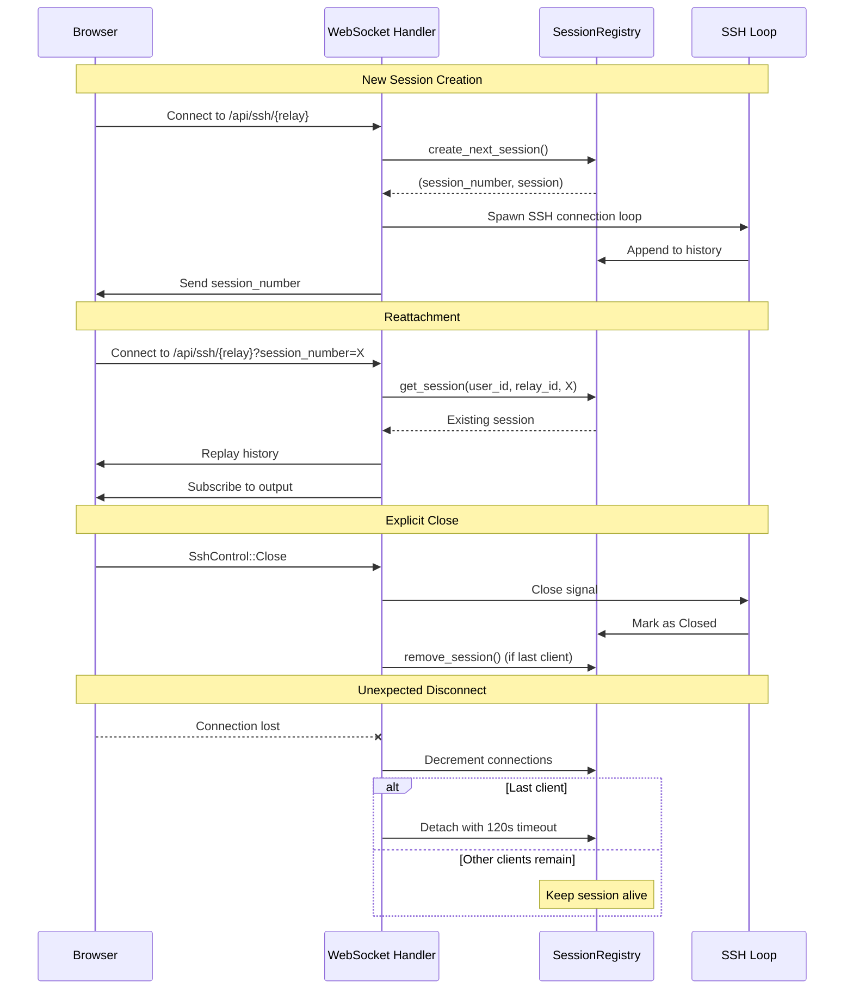
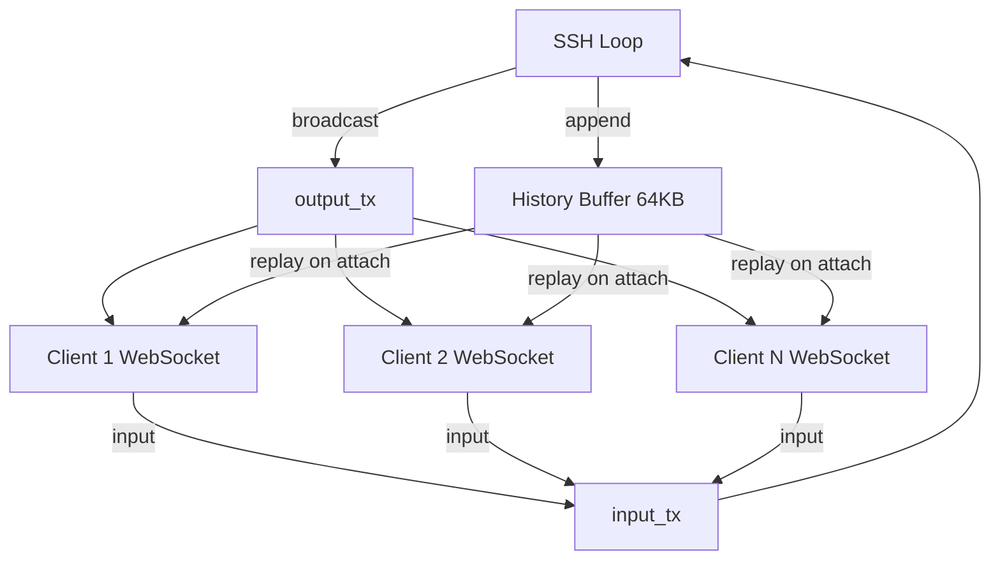
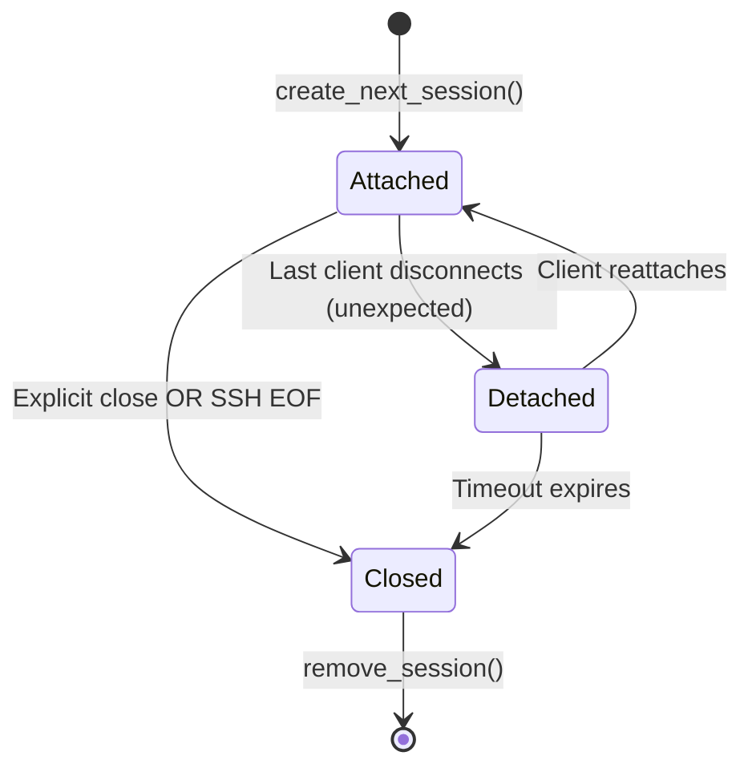

# Web Shell Implementation Status

> **Last Updated**: 2025-11-28  
> **Branch**: `webshell-refactor`

## Executive Summary

This document provides a comprehensive overview of the web shell implementation for RustyBridge. It consolidates information from multiple older planning documents ([WEB_SHELL_PLAN.md](../docs/WEB_SHELL_PLAN.md), [AUTO_LOAD.md](../docs/AUTO_LOAD.md), [WEB_ATTACH.md](../docs/WEB_ATTACH.md)) and reflects the current state of uncommitted changes.

### Vision

Provide persistent, user-friendly SSH terminals in the web UI with:
- **Session persistence** across page navigation and browser refreshes
- **Multi-session support** with a 4-session client-side cap
- **Detach/reattach workflow** for seamless reconnection
- **Multi-viewer support** allowing multiple browser tabs/windows to connect to the same SSH session
- **Floating window management** with drag, resize, minimize, and fullscreen capabilities

---

## Current Implementation State

### ✅ Phase 1: Baseline Functionality (COMPLETE)

#### Server-Side Session Registry
**Location**: [crates/server-core/src/sessions.rs](../crates/server-core/src/sessions.rs)

- ✅ `SessionRegistry` with thread-safe session management
- ✅ `SshSession` struct with:
  - Session identification: `(user_id, relay_id, session_number)`
  - State management: `Attached`, `Detached`, `Closed`
  - Multi-viewer support via `active_connections` counter
  - Scrollback history buffer (64KB)
  - Broadcast channels for multi-attach (`output_tx`)
  - Input channel for client→SSH data (`input_tx`)
  - Close signal broadcast (`close_tx`)
- ✅ Session lifecycle methods:
  - `create_next_session()` - Auto-increments session numbers
  - `get_session()` - Retrieve by (user_id, relay_id, session_number)
  - `remove_session()` - Cleanup
  - `list_sessions_for_user()` - Query all user sessions
  - `cleanup_expired_sessions()` - Background cleanup task
- ✅ History management:
  - `append_to_history()` - Circular buffer with 64KB cap
  - `get_history()` - Replay on reattach

#### WebSocket API
**Location**: [crates/rb-web/src/app/api/ssh_websocket.rs](../crates/rb-web/src/app/api/ssh_websocket.rs)

- ✅ `GET /api/ssh/{relay_name}?session_number` - WebSocket endpoint with reattach support
- ✅ `GET /api/ssh/{relay_name}/status` - Authorization check endpoint
- ✅ `GET /api/ssh/sessions` - List active sessions for current user
- ✅ Typed WebSocket messages:
  - `SshClientMsg` - Client→Server (data + control commands)
  - `SshServerMsg` - Server→Client (data + EOF + exit_status + session_id)
  - `SshControl` - Control commands (Close, Resize)
- ✅ `handle_new_session()` - Creates SSH connection and session
- ✅ `handle_reattach()` - Reattaches to existing session with history replay
- ✅ Explicit close detection:
  - Distinguishes between user-initiated close vs network disconnect
  - Explicit close → immediate cleanup (if last client)
  - Unexpected disconnect → detach with 120s timeout
- ✅ Multi-viewer support:
  - Connection counting with atomic operations
  - Broadcast output to all attached clients
  - Shared input from any client

#### Frontend Session Management
**Location**: [crates/rb-web/src/app/session/](../crates/rb-web/src/app/session/)

**Types** ([types.rs](../crates/rb-web/src/app/session/types.rs)):
- ✅ `Session` model with:
  - `id` (UUID for window management)
  - `session_number` (backend session identifier)
  - `relay_name`, `title`, `status`
  - `minimized`, `fullscreen`, `geometry`
  - `thumbnail_data_url` (for dock preview)
  - `last_focused_at`, `z_index` (for window stacking)
- ✅ `SessionStatus` enum: Connecting, Connected, Closed, Error
- ✅ `WindowGeometry` struct: x, y, width, height

**Provider** ([provider.rs](../crates/rb-web/src/app/session/provider.rs)):
- ✅ `SessionContext` with 4-session cap enforcement
- ✅ Session actions:
  - `open()` - Create new session window
  - `open_restored()` - Open window for existing backend session
  - `close()` - Remove window
  - `close_with_command()` - Send explicit close to server before removing
  - `minimize()`, `restore()`, `focus()`
  - `toggle_fullscreen()`
  - `set_geometry()`, `set_status()`, `set_thumbnail()`
  - `set_session_number_from_term_id()` - Link window to backend session
- ✅ Drag-and-drop window management:
  - `start_drag()`, `update_drag()`, `end_drag()`
  - Z-index recalculation based on focus time
- ✅ Session cap event: `rb-session-cap-reached` custom event

**Components** ([components/](../crates/rb-web/src/app/session/components/)):
- ✅ `SessionGlobalChrome` ([global_chrome.rs](../crates/rb-web/src/app/session/components/global_chrome.rs)):
  - Dual drawer layout (left: sessions, right: relays)
  - Global mouse handlers for drag/drop
  - Tab-based navigation
- ✅ `SessionDock` ([session_dock.rs](../crates/rb-web/src/app/session/components/session_dock.rs)):
  - Minimized session chips with status indicators
  - Click to restore
- ✅ `SessionWindow` ([session_window.rs](../crates/rb-web/src/app/session/components/session_window.rs)):
  - Floating, draggable windows
  - Header with title, controls (minimize, fullscreen, close)
  - Fixed positioning with z-index management
  - Fullscreen mode

#### Terminal Component
**Location**: [crates/rb-web/src/app/components/terminal.rs](../crates/rb-web/src/app/components/terminal.rs)

- ✅ Dioxus typed WebSocket integration
- ✅ `on_close` callback for session cleanup
- ✅ Parallel receiving loop (fixes output blocking issue)
- ✅ Input capture with retry loop
- ✅ Explicit focus handling via `window.focusTerminal()`
- ✅ EOF handling with `eof: bool` flag

#### JavaScript Bridge
**Location**: [crates/rb-web/assets/xterm-init.js](../crates/rb-web/assets/xterm-init.js)

- ✅ `window.writeToTerminal()` - Write data from Rust to xterm
- ✅ `window.setupTerminalInput()` - Setup input callback to Rust
- ✅ `window.focusTerminal()` - Explicit focus trigger
- ✅ `window.fitTerminal()` - Trigger fit addon
- ✅ ResizeObserver with visibility checks
- ✅ Removed legacy `attachWebSocketToTerminal()` (now handled in Rust)

---

## 🚧 Phase 2: In Progress (Polish & Complete MVP)

### Priority 1: LocalStorage Integration

> [!IMPORTANT]
> **Goal**: Persist window geometry and dock state across page refreshes, with cleanup of actually clsed sessions properly.

#### Remaining Work
- [x] **LocalStorage helpers** in session provider:
  - Save/load window geometry per session (x, y, width, height)
  - Save/load dock collapsed state
  - Save/load minimized state per session
- [x] **Security considerations**:
  - Only store non-sensitive UI state (geometry, dock state, session_number)
  - Clear stale entries when sessions expire
  - Key format: `rb-session-{user_id}-{relay_id}-{session_number}`
- [x] **Auto-restore on page load**:
  - Query `/api/ssh/sessions` on mount
  - For each active session, call `open_restored(relay_name, session_number)`
  - Restore geometry from localStorage
  - Restore minimized/dock state
  - Toast notifications for restored sessions.
  - Cleanup stale localStorage entries

**Files to Modify**:
- [crates/rb-web/src/app/session/provider.rs](../crates/rb-web/src/app/session/provider.rs) - Add localStorage helpers
- [crates/rb-web/src/app/app_root.rs](../crates/rb-web/src/app/app_root.rs) - Add auto-restore on mount

---

### Priority 2: Real-Time Session Sync

> [!IMPORTANT]
> **Goal**: Replace polling with push-based session updates

#### Current State
- ✅ HTTP endpoint `/api/ssh/sessions` exists
- ❌ Frontend polls this endpoint (inefficient)
- ❌ No real-time updates when sessions change

#### Remaining Work
- [ ] **WebSocket/SSE endpoint** for session events: ( should we use SSE or Websockets? )
  - `GET /api/ssh/sessions/ws` or `GET /api/ssh/sessions/events`
  - Stream events: `SessionAdded`, `SessionUpdated`, `SessionRemoved`, use an Enum for strong types
  - Include: `relay_id`, `session_number`, `state`, `active_connections`
- [ ] **Server-side broadcast**:
  - Add broadcast channel to `SessionRegistry`
  - Emit events on `create_next_session()`, `attach()`, `detach()`, `close()`
  - Filter events per user in WebSocket handler
- [ ] **Frontend integration**:
  - Subscribe to session events on mount instead of our loop
  - Auto-open minimized windows for new sessions (with toast notification)
  - Update session status/connection count in real-time
  - Handle session removal (close windows)

**Design Decision Needed**:
- Dedicated session events WebSocket vs. general server→client messaging channel?
- General channel could also handle:
  - Server connection monitoring
  - Server version change notices
  - Other real-time notifications

**Files to Create/Modify**:
- New: `crates/rb-web/src/app/api/session_events.rs` (or extend existing)
- Modify: [crates/server-core/src/sessions.rs](../crates/server-core/src/sessions.rs) - Add event broadcast
- Modify: [crates/rb-web/src/app/session/provider.rs](../crates/rb-web/src/app/session/provider.rs) - Subscribe to events
- Dioxus SSE Docs [DIOXUS_0.7.1/STREAMS_SSE.md](../DIOXUS_0.7.1/STREAMS_SSE.md)
- Dioxus Websocket Docs [DIOXUS_0.7.1/WEBSOCKETS.md](../DIOXUS_0.7.1/WEBSOCKETS.md)

---

### Priority 2b: Window Management Polish

### Multi-Session Connection Indicators

#### Remaining Work
- [ ] **Connection count badge**:
  - Show "2 viewers" or "Shared with 2 others" in session window header
  - Update in real-time as connections change
  - Visual indicator (icon + count)
- [ ] **Yellow banner for multi-session**:
  - Display at top of xterm window when `active_connections > 1`
  - Message: "X sessions connected to this relay"
  - Dismissible or always visible?

**Files to Modify**:
- [crates/rb-web/src/app/session/components/session_window.rs](../crates/rb-web/src/app/session/components/session_window.rs)
- [crates/rb-web/src/app/components/terminal.rs](../crates/rb-web/src/app/components/terminal.rs)

---

### Priority 3: Window Management Polish

#### Remaining Work
- [x] **Bounds checking**: Prevent windows from being dragged off-screen
- [ ] **Default window geometry**:
  - Cascade windows (offset by 30px x/y)
  - Center first window
- [ ] **Window resizing**:
  - Add resize handles at edges
  - Save resized dimensions to localStorage
  - Trigger terminal fit on resize
- [ ] **New shell offsets**: Smart positioning for shells with no saved location
- [ ] **Keyboard navigation**:
  - Tab order for window focus
  - Escape to minimize focused window

**Files to Modify**:
- [crates/rb-web/src/app/session/provider.rs](../crates/rb-web/src/app/session/provider.rs)
- [crates/rb-web/src/app/session/components/session_window.rs](../crates/rb-web/src/app/session/components/session_window.rs)

---

### Priority 4: User Feedback & Error Handling

#### Remaining Work
- [ ] **Toast notifications**:
  - Session cap reached (currently only console warning)
  - Connection failures
  - Authentication errors
  - Session disconnected/reconnected
- [ ] **Disconnection handling**:
  - Visual indicator when WebSocket connection lost
  - Reconnection attempts with backoff
  - Show when server tells us a session was lost
- [ ] **Error states**:
  - Display connection errors in session window
  - Retry button for failed connections
  - Clear error messages for auth failures

**Files to Modify**:
- [crates/rb-web/src/app/session/provider.rs](../crates/rb-web/src/app/session/provider.rs)
- [crates/rb-web/src/app/components/terminal.rs](../crates/rb-web/src/app/components/terminal.rs)
- Add toast component (if not already exists)

---

## 📋 Phase 3: Future Enhancements

### Session Administration & Monitoring

> [!NOTE]
> **Goal**: Provide visibility into all active sessions for admins and users

#### Planned Features
- [ ] **Admin panel**:
  - View all active sessions across all users
  - Display: user, relay, session_number, state, connection count, duration
  - Show both web-shell sessions and SSH→relay→SSH sessions
  - Include IP info and connection metadata
  - Ability to forcefully close sessions
- [ ] **User profile page**:
  - Show user's own active sessions
  - Display connection details
  - Allow user to close their own sessions remotely
- [ ] **Session metadata tracking**:
  - Connection time, IP address, user agent
  - Reconnect events
  - How relay was initiated (ssh, web)
  - Duration, last activity timestamp

**New Files**:
- `crates/rb-web/src/app/pages/admin/sessions.rs`
- `crates/rb-web/src/app/pages/profile/sessions.rs`

**Database Changes**:
- Consider adding session metadata table for persistent audit trail

---

### Advanced Terminal Features

#### Remaining Work
- [ ] **Terminal resize support**:
  - Implement `SshControl::Resize` handling in server
  - Send resize commands when window/terminal size changes
  - Proper PTY resize via russh
- [ ] **Mouse events**:
  - Enable xterm.js mouse tracking
  - Forward mouse events to SSH for TUI support
  - Add toggle for mouse mode (some users may prefer text selection)
- [ ] **Additional SSH events**:
  - Review `SshClientMsg` and `SshServerMsg` for missing functionality
  - Implement best practices for SSH event handling

**Files to Modify**:
- [crates/rb-web/src/app/api/ssh_websocket.rs](../crates/rb-web/src/app/api/ssh_websocket.rs)
- [crates/rb-web/assets/xterm-init.js](../crates/rb-web/assets/xterm-init.js)

---

### Thumbnail Minimize Animation

> [!NOTE]
> **Reference**: [wip_genie_effect.html](../wip_genie_effect.html)

#### Current State
- ✅ Proof-of-concept genie effect animation exists
- ❌ Not integrated into session windows
- ❌ Needs cleanup and modularization

#### Remaining Work
- [ ] **Extract and modularize** genie effect:
  - Create reusable JS module
  - Clean up and optimize WebGL code
  - Add configuration options (duration, easing)
- [ ] **Integrate with session minimize**:
  - Capture xterm canvas on minimize
  - Animate from window position to dock chip position
  - Store thumbnail in session state
  - Display thumbnail in dock chip
- [ ] **Strategy toggle**:
  - Strategy A (current): Static snapshot on minimize
  - Strategy B (future): Periodic thumbnail refresh while minimized
  - Add user preference setting

**Files to Create/Modify**:
- New: `crates/rb-web/assets/genie-effect.js`
- Modify: [crates/rb-web/src/app/session/provider.rs](../crates/rb-web/src/app/session/provider.rs)
- Modify: [crates/rb-web/src/app/session/components/session_window.rs](../crates/rb-web/src/app/session/components/session_window.rs)

---

### Session Auditing & Replay

> [!IMPORTANT]
> **Goal**: Record all SSH sessions for compliance and debugging

#### Current State
- ✅ History buffer stores last 64KB for reconnect
- ❌ No persistent recording
- ❌ No replay UI

#### Remaining Work
- [ ] **Persistent session recording**:
  - Store all SSH I/O to database or file
  - Include timestamps for each chunk
  - Metadata: user, relay, session_number, start/end time
- [ ] **Replay UI**:
  - Admin view: Replay any session
  - User view: Replay own sessions (with proper claims)
  - Playback controls (play, pause, seek, speed)
  - Search/filter sessions by user, relay, date range
- [ ] **Retention policy**:
  - Configurable retention period
  - Automatic cleanup of old recordings
  - Export functionality for archival

**Database Schema**:
```sql
CREATE TABLE session_recordings (
    id INTEGER PRIMARY KEY,
    user_id INTEGER NOT NULL,
    relay_id INTEGER NOT NULL,
    session_number INTEGER NOT NULL,
    started_at TIMESTAMP NOT NULL,
    ended_at TIMESTAMP,
    recording_path TEXT NOT NULL,
    metadata JSON,
    FOREIGN KEY (user_id) REFERENCES users(id),
    FOREIGN KEY (relay_id) REFERENCES relay_hosts(id)
);

CREATE TABLE session_events (
    id INTEGER PRIMARY KEY,
    recording_id INTEGER NOT NULL,
    timestamp TIMESTAMP NOT NULL,
    event_type TEXT NOT NULL, -- 'data', 'resize', 'connect', 'disconnect'
    data BLOB,
    FOREIGN KEY (recording_id) REFERENCES session_recordings(id)
);
```

**New Files**:
- `crates/state-core/src/session_recorder.rs` - database accessors
- `crates/server-core/src/session_recorder.rs` - session recording logic for ssh and web sessions
- `crates/rb-web/src/app/pages/admin/session_replay.rs` - session replay UI
- `crates/rb-web/src/app/pages/profile.rs session view of active sessions and session history.

---

### Server-Enforced Session Limits

> [!NOTE]
> **Current**: 4-session cap enforced client-side only

#### Remaining Work
- [ ] **Server configuration**:
  - Add `server_options` table entries:
    - `max_active_ssh_sessions_per_user` (default: 4)
    - `max_active_ssh_sessions_global` (default: unlimited)
  - Admin UI to configure limits
- [ ] **Server-side enforcement**:
  - Check limits in `ssh_terminal_ws` before upgrade
  - Return clear error message when limit exceeded
  - Mirror limits to frontend for better UX
- [ ] **User-level overrides**:
  - Allow per-user session limits in user settings
  - Admin can set custom limits for specific users

**Files to Modify**:
- [crates/rb-web/src/app/api/ssh_websocket.rs](../crates/rb-web/src/app/api/ssh_websocket.rs)
- Add server options management (if not exists)

---

### Session Restoration Settings

> [!NOTE]
> **Goal**: Flexible session restoration behavior

#### Current State
- Sessions keyed by `(user_id, relay_id, session_number)`
- Same session accessible from any browser/device

#### Planned Options
- [ ] **Server-level config**:
  - Mode 1: Shared sessions (current) - `relay:user:session_number`
  - Mode 2: Per-device sessions - `relay:user:device_id:session_number`
  - Mode 3: Hybrid - Allow users to choose
- [ ] **User-level preference**:
  - Profile setting: "Restore sessions across devices" (on/off)
  - If off, use localStorage/sessionStorage for device-specific sessions
  - If on, use server-side session registry
- [ ] **Device identification**:
  - Generate stable device ID (stored in localStorage)
  - Include in session key if per-device mode enabled

**Files to Modify**:
- [crates/server-core/src/sessions.rs](../crates/server-core/src/sessions.rs)
- [crates/rb-web/src/app/session/provider.rs](../crates/rb-web/src/app/session/provider.rs)
- Add user preferences page (if not exists)

---

### Session Sharing & Collaboration

> [!CAUTION]
> **Security Implications**: Shared sessions require careful permission management and audit logging

#### Planned Features
- [ ] **One-time share links**:
  - Generate time-limited, single-use link to join session
  - Optional password protection
  - Access modes: Read-only (watch) vs Read-write (type)
- [ ] **Permission management**:
  - Owner can invite/kick collaborators
  - Public vs private sessions
  - RBAC integration (only share sessions you have access to)
- [ ] **Collaborator UI**:
  - Session header shows: Owner, Collaborators, Invite button
  - Permission badges: "Owner", "Collaborator", "Viewer"
  - Real-time presence indicators
- [ ] **Conflict resolution**:
  - Last writer wins for terminal input
  - Visual indicators for concurrent typing
  - Optional input locking (owner can mute others)
- [ ] **Audit logging**:
  - Log all join/leave events
  - Log invitation generation
  - Rate limiting on invitations

**Database Schema**:
```sql
CREATE TABLE session_shares (
    id INTEGER PRIMARY KEY,
    session_id TEXT NOT NULL, -- (user_id, relay_id, session_number)
    share_code TEXT UNIQUE NOT NULL,
    created_by INTEGER NOT NULL,
    access_mode TEXT NOT NULL, -- 'read' or 'write'
    password_hash TEXT,
    expires_at TIMESTAMP NOT NULL,
    max_uses INTEGER DEFAULT 1,
    uses INTEGER DEFAULT 0,
    FOREIGN KEY (created_by) REFERENCES users(id)
);

CREATE TABLE session_collaborators (
    id INTEGER PRIMARY KEY,
    session_id TEXT NOT NULL,
    user_id INTEGER,
    connection_id TEXT NOT NULL,
    access_mode TEXT NOT NULL,
    joined_at TIMESTAMP NOT NULL,
    FOREIGN KEY (user_id) REFERENCES users(id)
);
```

**New Files**:
- `crates/server-core/src/session_sharing.rs`
- `crates/rb-web/src/app/api/session_sharing.rs`
- `crates/rb-web/src/app/components/session_share_modal.rs`

---

## Known Issues & Limitations

### Current Limitations
1. **No persistent recording**: Sessions are only buffered in memory (64KB)
2. **No resize support**: Terminal resize commands not implemented
3. **No mouse events**: TUI applications with mouse support won't work
4. **Client-side session cap**: 4-session limit not enforced server-side
5. **No bounds checking**: Windows can be dragged off-screen
6. **No localStorage**: Window geometry not persisted across refreshes
7. **Polling for session list**: No real-time session updates

### Known Bugs
- **Windows can be dragged off-screen**: Need bounds checking
- **No toast for session cap**: Only console warning (event exists but no UI)

---

## Technical Architecture

### Session Lifecycle



### Multi-Viewer Architecture



### Session State Transitions



---

## Configuration

### Current Constants

| Constant | Value | Location | Notes |
|----------|-------|----------|-------|
| `MAX_SESSIONS` | 4 | [provider.rs:6](../crates/rb-web/src/app/session/provider.rs#L6) | Client-side cap |
| History buffer size | 64KB | [sessions.rs:52](../crates/server-core/src/sessions.rs#L52) | Per-session scrollback |
| Detach timeout | 120s | [ssh_websocket.rs:356](../crates/rb-web/src/app/api/ssh_websocket.rs#L356) | Unexpected disconnect |
| Broadcast channel capacity | 1024 | [ssh_websocket.rs:472](../crates/rb-web/src/app/api/ssh_websocket.rs#L472) | Output messages |
| Input channel capacity | 1024 | [ssh_websocket.rs:471](../crates/rb-web/src/app/api/ssh_websocket.rs#L471) | Input messages |

### Future Configuration (Planned)

These should be moved to server admin panel:
- `max_active_ssh_sessions_per_user`
- `max_active_ssh_sessions_global`
- `session_detach_timeout`
- `session_history_size`
- `session_recording_enabled`
- `session_recording_retention_days`

---

## Dependencies

### Rust Crates
- `tokio::sync::{RwLock, broadcast, mpsc}` - Session state and channels
- `chrono` - Timestamps
- `russh` - SSH client
- `dioxus::fullstack::TypedWebsocket` - WebSocket integration
- `serde` - Message serialization

### JavaScript Libraries
- `xterm.js` - Terminal emulator
- `xterm-addon-fit` - Terminal resizing
- `html-to-image` (planned) - Thumbnail capture for genie effect

---

## Migration Notes

### Breaking Changes from Previous Implementation
1. **WebSocket endpoint changed**: Now accepts `?session_number` query param
2. **Message format changed**: `SshServerMsg` now includes `session_id` field
3. **Terminal component**: Removed `attachWebSocketToTerminal()`, now uses Rust WebSocket

### Upgrade Path
- No database migrations required (sessions are in-memory only)
- Frontend changes are backward compatible (old sessions will fail gracefully)
- Server changes require full restart (no hot reload for WebSocket handlers)

---

## References

### Related Documents
- [WEB_SHELL_PLAN.md](../docs/WEB_SHELL_PLAN.md) - Original implementation plan (deprecated, no longer updated)
- [AUTO_LOAD.md](../docs/AUTO_LOAD.md) - Auto-restore design (deprecated, no longer updated)
- [WEB_ATTACH.md](../docs/WEB_ATTACH.md) - Detach/reattach architecture (deprecated, no longer updated)
- [wip_genie_effect.html](../wip_genie_effect.html) - Minimize animation prototype, example of genie effect

### Key Files
- [crates/server-core/src/sessions.rs](../crates/server-core/src/sessions.rs) - Session registry
- [crates/rb-web/src/app/api/ssh_websocket.rs](../crates/rb-web/src/app/api/ssh_websocket.rs) - WebSocket API
- [crates/rb-web/src/app/session/provider.rs](../crates/rb-web/src/app/session/provider.rs) - Frontend session management
- [crates/rb-web/src/app/components/terminal.rs](../crates/rb-web/src/app/components/terminal.rs) - Terminal component
- [crates/rb-web/assets/xterm-init.js](../crates/rb-web/assets/xterm-init.js) - Terminal JavaScript bridge

---

## Next Steps

### Immediate Priorities (Phase 2 Completion)
1. **LocalStorage integration** - Persist window geometry and restore sessions on page load
2. **Real-time session sync** - Replace polling with WebSocket/SSE for session events
3. **Window management polish** - Bounds checking, default positioning, resize support
4. **User feedback** - Toast notifications and error handling

### Short-Term Goals (Phase 3 Start)
1. **Session administration** - Admin panel and user profile session views
2. **Terminal resize** - Implement PTY resize support
3. **Thumbnail animation** - Integrate genie effect for minimize

### Long-Term Vision
1. **Session recording & replay** - Full audit trail with playback UI
2. **Session sharing** - Collaborative sessions with permission management
3. **Server-enforced limits** - Move session cap to server configuration
4. **Flexible restoration** - Per-device vs shared session modes
